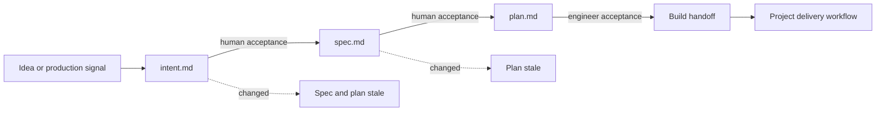

# AI-Native SDLC

A portable Agent Skill for turning substantial product work into an auditable decision chain:

```text
intent → spec → plan → build handoff
```

The Skill governs decisions before implementation. It records why the work matters, what must be true, how the code should change, who approved each stage, and which accepted revisions the next stage depends on. Implementation, merge, deployment, and production access remain in the project's normal delivery workflow.

Based on Anthropic's [AI-Native SDLC Playbook](https://claude.com/blog/the-ai-native-sdlc-playbook).

## Why use it

Planning documents often drift independently: requirements change while an old implementation plan still looks approved. This Skill makes that failure visible.

- Three focused artifacts separate product intent, specification, and implementation planning.
- Human acceptance is explicit through approver and timestamp metadata.
- Spec and plan pin the accepted upstream Git commits they were reviewed against.
- `sdlc-check` rejects invalid gates, missing approval evidence, and stale dependencies.
- High-risk work names policy owners and technical reviewers before implementation.
- An accepted plan ends in a concrete build handoff instead of an ambiguous “start coding.”

## Workflow



| Stage | Artifact | Primary question | Gate |
|---|---|---|---|
| Intent | `intent.md` | Why are we doing this, and for whom? | Product or incident owner acceptance |
| Spec | `spec.md` | What does done mean, and which policies constrain it? | Product owner plus policy reviewers |
| Plan | `plan.md` | Which code changes, in what order, with what proof? | Engineer; tech lead or architect for high risk |
| Handoff | Plan section | Who implements, reviews, rolls out, and supplies evidence? | Current accepted revision chain |

Production incidents enter through a read-only diagnosis that creates an incident intent. The Skill does not hotfix or deploy; the accepted plan hands remediation to the team's incident and delivery workflow.

## Install

The installable unit is [`skills/ai-native-sdlc/`](skills/ai-native-sdlc/), not the repository root.

### Requirements

- Python 3.10 or newer
- Git for accepted-revision and stale-chain validation
- Optional POSIX shell for the extensionless command launchers

### Claude Code

```bash
# User-wide
cp -R skills/ai-native-sdlc ~/.claude/skills/

# Project-local
cp -R skills/ai-native-sdlc <project>/.claude/skills/
```

### Codex

```bash
cp -R skills/ai-native-sdlc ~/.codex/skills/
```

For another Agent Skills host, copy `skills/ai-native-sdlc/` into that host's Skill directory. The installed layout is self-contained:

```text
ai-native-sdlc/
├── SKILL.md
├── LICENSE
├── assets/
├── references/
├── schemas/
└── scripts/
```

## Use

After installation, ask naturally. The agent loads the Skill when the request matches its description; no manual initialization command or host-specific slash command is required.

> I want to add SSO to the admin dashboard. Start with the intent.

> Checkout 5xx errors spiked after the campaign launch. Diagnose this read-only and create the incident intent.

On the first applicable task in a project, the agent runs the bundled bootstrap to create `docs/sdlc/` and install the managed AI-Native SDLC block in `AGENTS.md`. At each gate, the agent runs the bundled checker before proceeding. Reinstalling or updating the Skill does not require the user to remember a separate workflow; the next applicable invocation refreshes the managed block when needed.

The `bootstrap` and `sdlc-check` executables are bundled for deterministic agent use and troubleshooting. They are implementation details of the Skill, not required setup steps for normal use.

## Generated project artifacts

```text
<project>/
├── AGENTS.md
└── docs/sdlc/
    └── <slug>/
        ├── intent.md
        ├── spec.md
        └── plan.md
```

Feature slugs use kebab-case. Incident slugs use `incident-<YYYY-MM-DD>-<short-desc>`.

Templates remain inside the installed Skill and are read on demand; they are not copied into every project. The project stores only its decisions and a managed pointer to the workflow.

## Artifact lifecycle

Artifacts use these states:

```text
draft → accepted | rejected
accepted → stale | superseded
rejected → draft
stale → draft | superseded
```

Accepted artifacts retain `accepted_by` and `accepted_at`. A spec records `intent_ref`; a plan records both `intent_ref` and `spec_ref`. A semantic change to accepted content requires another review. Changing intent invalidates spec and plan; changing spec invalidates plan.

See the installed Skill's [`references/artifact-lifecycle.md`](skills/ai-native-sdlc/references/artifact-lifecycle.md) and [`schemas/`](skills/ai-native-sdlc/schemas/) for the normative contract.

## When to use it

Use the full chain for substantial features, refactors with product or policy impact, migrations, external contract changes, and structural incident follow-up. Auth, payments, PII, compliance, migrations, and systems with prior post-mortems are high risk.

Skip the full chain for typo fixes, routine dependency bumps, policy-neutral documentation edits, and reverts. Emergency hotfix execution stays in the team's incident workflow and requires retrospective intent and spec within one business day.

## Repository layout

```text
.
├── .github/workflows/        # repository CI
├── scripts/                  # maintainer validation and regression tools
├── tests/                    # deterministic repository tests
├── evals/                    # model cases and frozen baselines
└── skills/ai-native-sdlc/    # installable Skill package
```

Runtime commands live inside the Skill package. Maintainer tests, model evaluations, and regression tooling remain outside it so copied installations contain no development-only files.

## Development

See [CONTRIBUTING.md](CONTRIBUTING.md) for package boundaries, required checks, semantic regression, baseline promotion, and the pull-request checklist.

Fast deterministic checks:

```bash
python3 -m unittest discover -s tests -v
python3 scripts/validate_package.py
python3 scripts/regression.py --check
```

Semantic changes to the Skill, templates, lifecycle, or approval policy also require:

```bash
python3 scripts/regression.py
```

## Privacy

The installable Skill contains no telemetry, notification hook, workstation path, account identifier, or host-specific configuration. Runtime scripts make no network requests. Local agent-host hooks are ignored through `**/.github/hooks/` and must never be committed into the Skill package.

## License

MIT. See [LICENSE](LICENSE). The installable package carries its own copy at [`skills/ai-native-sdlc/LICENSE`](skills/ai-native-sdlc/LICENSE).
